# Cookbook System - Quickstart

## What Is This? (30 seconds)

A structured way to document your team's code patterns so **AI agents can follow them automatically**.

Think of it as: **"Rules for robots, readable by humans"**

## The Big Picture

```
┌─────────────┐
│  AI Agent   │
│  gets task  │
└──────┬──────┘
       │
       ▼
┌─────────────────────────────────────────┐
│  1. Read _index.yaml                    │
│     "What stack? What sections exist?"  │
└──────┬──────────────────────────────────┘
       │
       ▼
┌─────────────────────────────────────────┐
│  2. Check constraints/                  │
│     "What am I NOT allowed to do?"      │
└──────┬──────────────────────────────────┘
       │
       ▼
┌─────────────────────────────────────────┐
│  3. Find pattern in quick_reference     │
│     "How do I create X?"                │
└──────┬──────────────────────────────────┘
       │
       ▼
┌─────────────────────────────────────────┐
│  4. Load pattern file                   │
│     "Here's the template + rules"       │
└──────┬──────────────────────────────────┘
       │
       ▼
┌─────────────────────────────────────────┐
│  5. Copy from examples/                 │
│     "Here's working code"               │
└──────┬──────────────────────────────────┘
       │
       ▼
┌─────────────┐
│   Agent     │
│ writes code │
└─────────────┘
```

## Quick Example: Creating a React Component

### Human asks:
> "Create a Button component with TypeScript"

### Agent flow:


### What the agent reads:

**1. _index.yaml** (context)
```yaml
quick_reference:
  new_component: "patterns/component.yaml#react-component"
```

**2. constraints/typescript.yaml** (boundaries)
```yaml
- "Props must have TypeScript interface"
- "No 'any' type allowed"
```

**3. patterns/component.yaml** (template)
```yaml
template: |
  interface ButtonProps {
    label: string
  }
  
  export function Button({ label }: ButtonProps) {
    return <button>{label}</button>
  }
```

**4. examples/Button.tsx** (working code)
```typescript
// Real working example to copy from
```

### Result:
Agent creates a compliant component in seconds, following all team rules.

## File Structure (Simple)

```
team-cookbook/
├── _index.yaml              👈 START HERE - navigation hub
│
├── constraints/             👈 READ SECOND - what NOT to do
│   ├── security.yaml
│   └── typescript.yaml
│
├── patterns/                👈 READ THIRD - how to do things
│   ├── component.yaml
│   └── api.yaml
│
└── examples/                👈 READ LAST - working code
    ├── Button.tsx
    └── api-endpoint.ts
```

## 3 Steps to Use This System

### Step 1: Point Agent to `_index.yaml`
```
"Read the cookbook at ./team-cookbook/_index.yaml before starting"
```

You can copy and paste the file `../templates/AGENTS.md` into your environment.

### Step 2: Agent Navigates Automatically
- Loads context and tech stack
- Checks constraints first
- Finds relevant patterns
- Copies from examples

### Step 3: Validate Output
- Check it follows constraints
- Matches pattern structure
- Looks like examples

## 5-Minute Setup for Your Team

### 1. Copy the Mini-Complete Example
```bash
cp -r examples/mini-complete ./my-team-cookbook
```

### 2. Edit `_index.yaml`
```yaml
context:
  stack: ["React", "TypeScript", "Node.js"]  # Your stack
  
quick_reference:
  new_component: "patterns/component.yaml"   # Your patterns
```

### 3. Add One Constraint
```yaml
# constraints/typescript.yaml
constraints:
  - "No 'any' type"
  - "Props need interfaces"
```

### 4. Add One Pattern
```yaml
# patterns/component.yaml
template: |
  interface Props { }
  export function Component({ }: Props) { }
```

### 5. Add One Example
```typescript
// examples/Button.tsx
// Working code from your codebase
```

**Done!** You have a working cookbook.

## When to Use This

✅ **Good for:**
- Code patterns that repeat
- Team conventions
- Security/performance rules
- Integration patterns
- "How we do X here"

❌ **Not for:**
- One-off solutions
- Exploratory code
- Frequently changing patterns
- External library docs

## Key Principles (Remember These)

### 1. Constraints Before Freedom
Tell agents what NOT to do first.

### 2. Templates Over Explanations
Show the code, skip the essay.

### 3. Examples Beat Descriptions
Working code > long descriptions.

### 4. One Source of Truth
Link to authoritative source, don't duplicate.

## Common Questions

**Q: Do I need to document everything?**  
A: No. Start with your most repeated patterns.

**Q: How often should I update?**  
A: When a pattern changes or you adopt a new convention.

**Q: Can humans use this too?**  
A: Yes! It's optimized for agents but readable by humans.

**Q: What if my pattern is complex?**  
A: Break it into smaller patterns, or add detailed examples.

## Next Steps

1. **See it in action**: Check `examples/mini-complete/` for a tiny but complete cookbook
2. **Use individual templates**: Check `templates/` for `_index.yaml`, constraints, and patterns templates
3. **Read full docs**: See `README.md` for complete reference

## Visual: Full Agent Decision Flow

```mermaid
flowchart TD
    Start([Agent Task: Create Component]) --> Index[Load _index.yaml]
    Index --> Context{Has context?}
    Context -->|Yes| QuickRef[Check quick_reference]
    Context -->|No| Error1[❌ No cookbook found]
    
    QuickRef --> Found{Pattern found?}
    Found -->|Yes| LoadPattern[Load pattern file]
    Found -->|No| Error2[❌ No pattern for this task]
    
    LoadPattern --> LoadConstraints[Load constraints/]
    LoadConstraints --> HasConstraints{Constraints exist?}
    
    HasConstraints -->|Yes| CheckRules[Verify against rules]
    HasConstraints -->|No| UsePattern[Use pattern directly]
    
    CheckRules --> UsePattern
    UsePattern --> HasExample{Example exists?}
    
    HasExample -->|Yes| CopyExample[Copy from examples/]
    HasExample -->|No| UseTemplate[Use template]
    
    CopyExample --> Generate[Generate code]
    UseTemplate --> Generate
    
    Generate --> Validate[Validate against constraints]
    Validate --> Pass{Passes?}
    
    Pass -->|Yes| Success([✅ Code generated])
    Pass -->|No| Fix[Fix violations]
    Fix --> Validate
    
    style Start fill:#e1f5ff
    style Success fill:#d4edda
    style Error1 fill:#f8d7da
    style Error2 fill:#f8d7da
    style LoadConstraints fill:#fff3cd
    style CheckRules fill:#fff3cd
```



---

**Remember**: Simple > Complete. Start small, grow as needed.
