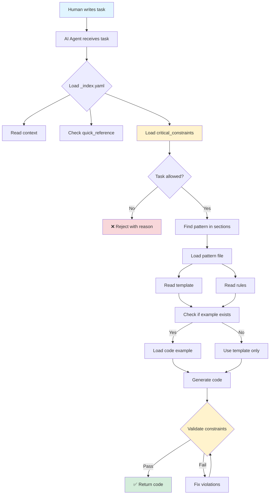

# Cookbook System - Visual Overview

## The Big Picture

```
┌─────────────────────────────────────────────────────────────────────┐
│                        COOKBOOK SYSTEM                               │
│                                                                       │
│  "Rules for robots, readable by humans"                             │
└─────────────────────────────────────────────────────────────────────┘

                              ┌───────────┐
                              │ AI Agent  │
                              │ gets task │
                              └─────┬─────┘
                                    │
                                    ▼
┌───────────────────────────────────────────────────────────────────────┐
│                          _index.yaml                                  │
│  ┌─────────────────┐  ┌──────────────┐  ┌─────────────────┐         │
│  │   Context       │  │   Sections   │  │ Quick Reference │         │
│  │ • Stack         │  │ • Priority   │  │ task → pattern  │         │
│  │ • Architecture  │  │ • Files      │  │ task → example  │         │
│  └─────────────────┘  └──────────────┘  └─────────────────┘         │
└───────────────────────────────────────────────────────────────────────┘
                                    │
                    ┌───────────────┼───────────────┐
                    ▼               ▼               ▼
        ┌───────────────┐ ┌─────────────┐ ┌──────────────┐
        │ CONSTRAINTS   │ │  PATTERNS   │ │  EXAMPLES    │
        │ "DON'T DO"    │ │ "HOW TO DO" │ │ "WORKING     │
        │               │ │             │ │  CODE"       │
        └───────────────┘ └─────────────┘ └──────────────┘
```

## File System Structure

```
team-cookbook/
│
├── 📋 _index.yaml                    ⭐ START HERE
│   └── Navigation hub for everything
│
├── 🚫 constraints/
│   ├── security.yaml                 ❗ Check FIRST
│   ├── performance.yaml
│   └── typescript.yaml
│
├── 📐 patterns/
│   ├── component.yaml                📝 Templates
│   ├── api.yaml
│   └── database.yaml
│
├── 📦 schemas/
│   ├── api-contracts.yaml            🔷 Data structures
│   └── domain-models.yaml
│
├── 🔄 workflows/
│   ├── deployment.yaml               ⚙️ Step-by-step
│   └── ci-cd.yaml
│
├── 🔌 integrations/
│   ├── auth.yaml                     🌐 External services
│   └── payments.yaml
│
├── 🧪 testing/
│   └── strategies.yaml               ✅ Test patterns
│
├── 🛠️ tools/
│   └── scripts.yaml                  🔧 CLI & automation
│
├── 💡 examples/
│   ├── UserService.ts                ✨ Working code
│   └── api-endpoint.ts
│
├── ❓ troubleshooting/
│   └── common-errors.yaml            🔍 Known issues
│
└── 📖 decisions/
    └── architecture.yaml             💭 Why we chose X
```

## Information Flow



## Priority Reading Order

```
┌────────┬──────────────────────┬────────────────────────────┐
│ STAGE  │ WHAT TO READ         │ WHY                        │
├────────┼──────────────────────┼────────────────────────────┤
│ 1st    │ _index.yaml          │ Understand context         │
│        │                      │ Find navigation paths      │
├────────┼──────────────────────┼────────────────────────────┤
│ 2nd    │ constraints/         │ Learn boundaries           │
│        │                      │ Avoid violations           │
├────────┼──────────────────────┼────────────────────────────┤
│ 3rd    │ patterns/            │ Get implementation guide   │
│        │                      │ Copy templates             │
├────────┼──────────────────────┼────────────────────────────┤
│ 4th    │ examples/            │ See working code           │
│        │                      │ Adapt for your task        │
└────────┴──────────────────────┴────────────────────────────┘
```

## File Format Comparison

### Traditional Docs (Markdown)
```markdown
# How to Create a Component

First, you need to understand React components.
Components are the building blocks...

Here's what you need to know:
- Props are passed from parent
- State is local to component
- Use functional components

Example:
[long prose explanation]
[maybe code at the end]
```

**Problems:**
- 🐌 Slow to parse
- 💬 Too much narrative
- 🔍 Hard to find specific info
- 🤖 Agents must interpret prose

### Cookbook System (YAML)
```yaml
patterns:
  - id: "react-component"
    template: |
      interface Props { }
      export function Name({ }: Props) { }
    
    rules:
      - "Use named exports"
      - "Destructure props"
    
    example_ref: "examples/Button.tsx"
```

**Benefits:**
- ⚡ Fast to parse
- 🎯 Direct information
- 🔗 Easy navigation
- 🤖 Machine-readable

## Agent Decision Tree

```
Task: "Create a Button component"
│
├─ Load _index.yaml
│  └─ quick_reference.new_component → "patterns/component.yaml"
│
├─ Check constraints/react.yaml
│  ├─ ✅ Use functional components
│  ├─ ✅ Destructure props
│  └─ ✅ Named exports only
│
├─ Load patterns/component.yaml
│  ├─ Read template
│  ├─ Read rules
│  └─ See example_ref → "examples/Button.tsx"
│
├─ Load examples/Button.tsx
│  └─ Copy working code structure
│
└─ Generate Button component
   └─ Validate against constraints ✅
```

## Comparison: With vs Without Cookbook

### ❌ Without Cookbook

```
Agent: "Creating a component..."
└─ Generates code based on general knowledge
   ├─ Might use class components
   ├─ Might use default exports
   ├─ Might not follow team naming
   └─ 🎲 Inconsistent output
```

### ✅ With Cookbook

```
Agent: "Creating a component..."
└─ Reads cookbook first
   ├─ Checks constraints (no class components)
   ├─ Follows pattern template
   ├─ Copies from working example
   └─ 🎯 Consistent, compliant output
```

## Scale Examples

### Small Project (100 files)
```
cookbook/
├── _index.yaml
├── constraints/
│   └── typescript.yaml
├── patterns/
│   ├── component.yaml
│   └── api.yaml
└── examples/
    ├── Button.tsx
    └── endpoint.ts
```
**5-10 files total**

### Medium Project (1000 files)
```
cookbook/
├── _index.yaml
├── constraints/ (3-5 files)
├── patterns/ (10-15 files)
├── schemas/ (5-10 files)
├── workflows/ (5-10 files)
└── examples/ (20-30 files)
```
**50-70 files total**

### Large Project (10000+ files)
```
cookbook/
├── _index.yaml
├── constraints/ (10+ files)
├── patterns/ (30+ files)
├── schemas/ (20+ files)
├── workflows/ (15+ files)
├── integrations/ (10+ files)
├── testing/ (10+ files)
└── examples/ (50+ files)
```
**150-200 files total**

**Note**: Even for 10,000+ codebase files, cookbook stays under 200 files!

## Key Metrics

```
┌─────────────────────────┬──────────────┬──────────────┐
│ METRIC                  │ TRADITIONAL  │ COOKBOOK     │
├─────────────────────────┼──────────────┼──────────────┤
│ Time to find pattern    │ 5-15 minutes │ 10-30 seconds│
│ Code consistency        │ Low          │ High         │
│ Onboarding (AI agents)  │ Many prompts │ 1-2 prompts  │
│ Maintenance overhead    │ High         │ Medium       │
│ Constraint enforcement  │ Manual       │ Automatic    │
└─────────────────────────┴──────────────┴──────────────┘
```

## Common Patterns Visualized

### Pattern: Component
```
Input: Task                Output: Code
    │                          ▲
    ▼                          │
┌─────────┐              ┌──────────┐
│ Pattern │──template──→ │ Generate │
│  File   │              │          │
└─────────┘              └──────────┘
    │ rules                   ▲
    └────────validates────────┘
```

### Pattern: API Endpoint
```
Request Spec              Generated Code
    │                          ▲
    ▼                          │
┌─────────┐              ┌──────────┐
│ Pattern │──template──→ │ Generate │
│  + API  │              │ endpoint │
│ Schema  │              │          │
└─────────┘              └──────────┘
    │ constraints             ▲
    └─────validates───────────┘
```

## Quick Reference Format

```yaml
# Maps TASK to EXACT LOCATION
quick_reference:
  # Format: task_name: "path/to/file.yaml#section-id"
  
  new_component: "patterns/component.yaml#react-component"
  new_api: "patterns/api.yaml#endpoint-template"
  new_test: "testing/unit.yaml#test-template"
  
  # One lookup = exact answer
```

## The Golden Rule

```
╔═══════════════════════════════════════════════════════════╗
║                                                           ║
║  "If you can't explain it simply,                        ║
║   you don't understand it well enough."                  ║
║                                      - Einstein           ║
║                                                           ║
║  Applied to this system:                                 ║
║  • YAML over prose                                       ║
║  • Templates over explanations                           ║
║  • Examples over descriptions                            ║
║  • Rules over reasoning                                  ║
║                                                           ║
╚═══════════════════════════════════════════════════════════╝
```

---

## Next Steps

1. 📖 Read [QUICKSTART.md](QUICKSTART.md) for step-by-step guide
2. 🔍 Explore [examples/mini-complete/](examples/mini-complete/) for working cookbook
3. 📋 Copy [templates/](templates/) to start your own
4. 📚 See [README.md](README.md) for complete reference

**Start simple. Grow as needed.**
